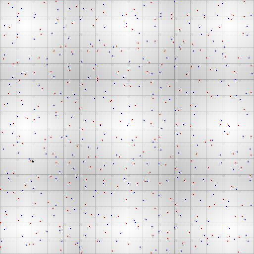

# Hypervectors

## What is Hyperdimensional Computing?

Hyperdimensional computing (HDC) represents concepts as high-dimensional vectors (also called hypervectors) and manipulates them with algebraic operations, typically the dimension (of vectors) can be as high as thousands or millions.

The key insight is that random vectors in high-dimensional spaces are **nearly orthogonal**: giving each concept a unique, robust representation that tolerates potential ambiguity and interference, all without central orchestration. 

In that sense, the traditional mantra of curse of dimensionality becomes the **blessing of dimensionality**.

Motivated readers should perform their own background research on this topic and make judgement of their own. There are quite a few introductory papers covering this topic.

## Sparse Binary Representation

`kongming` specializes in **sparse binary** hypervectors. Each vector has a fixed, large number of dimensions (e.g., 65,536/64K or 1,048,576/1M), but only a very small fraction of them are "on" (set to 1). The sparsity is controlled by the [Model](../api/hv/common/models.md) configuration.

Furthermore, we focus on a special sparse binary configuration: **SparseSegmented** where each vector is divided into equal-sized *segments*, and exactly one bit is ON per segment. For example, each of the 8bit-model hypervectors will have total dimension of $2^{16}=65536$, divided into $256$ segments, where each segment of $256$ dimension will have one (and only one) ON bit.

Alternatively you can imagine each **SparseSegmented** hypervector as a list of phasors, where the offset of ON bit (within the host segment) represents the discretized phase. For the above-mentioned 8bit models, each hypervector will have $256$ such phasers, each with $256$ discrete phase around the unit circle.

In general, this unique constraint enables:
- **Compact storage**: only the offsets of ON bit are needed, which is the bare entropy for the presentation;
- **Efficient operations**: Unlike neural nets where weights are recorded in float-point numbers, binary operations can be performed very efficiently with modern memory / CPUs, and without the need of GPU for either float-point operations or matrix manipulations.

## Similarity and distance measure

Two vectors are compared via **overlap** — the count of segments with the same ON bit offset. This is conceptually equivalent to a dimension-wise AND operation.

For a model (for example, 8bit model), with dimension $N=2^{16}=65536$ and sparsity $s=1/256$:

naturally, a vector's overlap with itself equals its cardinality $M=Ns=256$.

the expected overlap between two random vectors $A$ and $B$:

$$\text{E}[O(A, B)] = Ns^2 = 1$$

Actually, the overlap (of random vectors) follows a Poisson distribution with $\lambda=1$.

The commonly-used distance measure (or dis-similar measure) for binary vectors is Hamming Distance, equivalent to a bitwise XOR operation. As we discussed (and proved) in [the paper](https://arxiv.org/abs/2310.18316), the **overlap** and **Hamming distance** for **sparse binary** hypervectors are two sides of the same coin, with the following equation:

$$2 \times O(A, B) + H(A, B) = 2M$$

the more overlap they have, the closer two vectors in Hamming space.

To visualize this with concrete example, we have two random 64K/8-bit hypervectors drawn over the same grid. Each of the $256$ segments contributes one dot, placed inside its own segment group at the offset
of that segment's ON bit — **red** for the first vector, **blue** for the second. The heavy grid lines delimit the segment groups; the fine ones are individual offsets.

  

The two random hypervector overlaps on exactly **one** segment, marked in **black** : $O(A,B) = 1$.

This is what near-orthogonality looks like: two vectors drawn independently from
a $65{,}536$-dimensional space, agreeing by coincidence on a single segment out
of $256$ — and nowhere else.

## Supported Models

A [Model](../api/hv/common/models.md) determines the total number of dimensions (width), how those dimensions are divided into segments (cardinality and sparsity), and therefore implies critical storage and compute characteristics.

| Model | Width/Dimension | Sparsity Bits | Cardinality (ON bits)  | Segment Size |
|-------|-------|---------------|-------------|----------------------|
| `MODEL_64K_8BIT` | 65,536 | 8 | 256 | 256 |
| `MODEL_1M_10BIT` | 1,048,576 | 10 | 1,024 | 1,024 |
| `MODEL_16M_12BIT` | 16,777,216 | 12 | 4,096 | 4,096 |
| `MODEL_256M_14BIT` | 268,435,456 | 14 | 16,384 | 16,384 |
| `MODEL_4G_16BIT` | 4,294,967,296 | 16 | 65,536 | 65,536 |

### Model properties

All model functions take a Model enum value and return the derived property:

Note

For simplicity, we use function names from Python. The counterparts from Go / Rust can be found by consulting their respective references.

| Function | Description |
|----------|-------------|
| `width` | Total dimension count (`2^width_bits`) |
| `cardinality` | Number of ON bits (= number of segments) |
| `sparsity` | Fraction of ON bits (`1 / segment_size`) |
| `segment_size` | Dimensions per segment |

### How to Choose a Model

- **`MODEL_64K_8BIT`**: Fast prototyping, with minimal memory footprint and high performance (due to SIMD). Good for tests, experiments and production.
- **`MODEL_1M_10BIT`**: General-purpose, balances performance and storage.
- **`MODEL_16M_12BIT`**: General-purpose, for the adventurous.
- **`MODEL_256M_14BIT` / `MODEL_4G_16BIT`**: Very high capacity, not there yet.

In general, larger models provide more orthogonal space (lower collision probability) at the cost of more memory per vector.

Note

The storage consideration above applies to **SparseSegmented**, the one type containing raw offsets. There are other types of **sparse binary hypervector**,  typically defined by a **recipe**: a seed, or a seed plus members, and carries only that instead of raw offsets. For example, **Sparkle** stores its seed and derives its offsets on demand; composites such as **Set** and **Sequence** hold references to their members, so they cost far less than a materialized vector both in memory and on the wire.

Additionally, the bits are computed on first observation and cached, then released again on `compact()`. Constructing a vector you never observe therefore costs almost nothing — see [lazy materialization](../api/hv/types.md#lazy-materialization).

