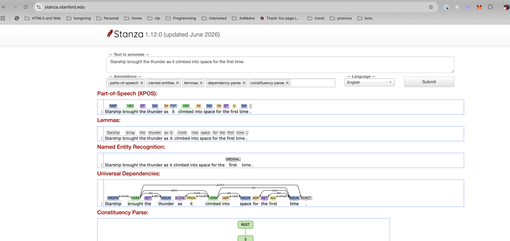

# Introduction

The original idea came from a random bump into the [stanza](https://stanfordnlp.github.io/stanza/) NLP package (from Stanford) and its web-based rendering.

What the website shows is a **dependency parse**: the sentence split into tokens, each token tagged with its part of speech, lemma, and named-entity type, and for the interesting part, every token attached to a **head** token by a labeled edge (subject-of, object-of, modifier-of, …). The nodes and edges form a dependency tree representing the sentence's grammatical structure.

Language parsing is one of the fundamental tasks in NLP, and serves as a pre-processor for many downstream language-understanding applications: information extraction, question answering, knowledge-graph construction all start from exactly these parse trees.

## A brief history, and where we sit

The dominant technique before neural networks was the HMM family: Hidden Markov Models and their hierarchical variants, where decoding recovers a sequence of latent states with learned transition and emission probabilities. Most modern parsers have switched to specially-trained neural networks, which lifted accuracy substantially at the cost of opaque models, heavy computation, and hundreds of megabytes of storage per language model.

### State-space models, generally

The HMM belongs to a much larger family: **state-space models** (SSMs). The shared idea is fundamentally simple: a *latent state* summarizes everything about the past that matters, a *transition* rule evolves it step by step, and each observation is *emitted* from the current state. Choose discrete states and you have the HMM; choose linear-Gaussian ones and you have the Kalman filter; let a network learn the transition and you have an RNN. Under this lens, sequence understanding is always the same job: maintain a compressed state, and keep it honest against the observations.

SSMs are having a renaissance. Modern deep-learning variants (the S4/Mamba line) rediscovered that a recurrent state gives **linear-time, constant-memory** sequence processing, where attention pays quadratic cost and must hold the whole window, and made it competitive at scale. 

The *classical* virtues of SSMs never went away either: an explicit, inspectable state, principled inference (Viterbi decoding, Kalman filtering) instead of learned approximation, and reasonable model performance from a modest amount of data. What killed the classical SSM in practice was the **state-space explosion**: rich linguistic states make the transition tables astronomically large and their statistics hopelessly sparse.

The parser in this project is best understood as a **revival of the hierarchical HMM rebuilt on hypervectors**, attacking that exact weakness head-on. High-dimensionality offers practically unlimited orthogonal vectors to work with, superposition holds an enormous state space, potentially hierarchical in the same shape, and evidence pooling tames the sparse statistics.

It keeps the SSM virtues the neural approximations have given up: transparency and inference you can trace. The latent states are still there: they are spines of grammar edges, and decoding is still Viterbi over a beam. What changed is the substrate: instead of probability tables, every statistic lives in superposed sparse binary vectors, learned over time and read back by similarity.

## The goal

Functionally, the parser sets out to do what the stanza demo does: given a tokenized sentence in English, Chinese, or any desired language in the future, it emits the same artifacts: per-token part of speech, lemma, named-entity spans, and the labeled head edges that form a complete dependency tree. Text corpora of different languages are condensed into their own language models which can generalize, and the same engine runs decoding with no language-specific code paths.

Matching that output contract, however, is the baseline rather than the point. The focus here is not to achieve performance parity with state-of-the-art neural networks, but to demonstrate the feasibility of an alternative model with the following characterizations:

- **compaction** — the trained model for 2 languages (English and Chinese for now) fits in tens of MBs (see [Evaluations](evaluations.md) for more details);
- **efficiency** — training is a single pass, and decoding is integer/bitwise computation with no GPU needed;
- **transparency** — every decoding decision is transparent: you can print, trace, and improve it incrementally.

## Bootstrapping

Unsurprisingly, this one learns from annotated trees. The annotations are produced by an existing parser (stanza, following the Universal Dependencies conventions): a typical teacher–student setup. The teacher supplies a training tree for each incoming sentence, and the student learns to reproduce and generalize them in an entirely different representation. The quality ceiling is therefore the teacher's; the demonstration is about the *representation*, not about outrunning the state of the art.

## Further reading

The rest of the chapter walks the pipeline:
- [Training](training.md): how trees become substrate writes;
- [Decoding](decoding.md): how token streams become trees again;
- [Evaluations](evaluations.md): measured quality;
- [Discussions](discussions.md): why it works, and what's next.

## References

State-space models, classical and modern:

- L. R. Rabiner — *A Tutorial on Hidden Markov Models and Selected Applications in Speech Recognition*. Proc. IEEE 77(2), 1989. [DOI](https://doi.org/10.1109/5.18626)
- S. Fine, Y. Singer, N. Tishby — *The Hierarchical Hidden Markov Model: Analysis and Applications*. Machine Learning 32(1), 1998. [DOI](https://doi.org/10.1023/A:1007469218079)
- A. Gu, K. Goel, C. Ré — *Efficiently Modeling Long Sequences with Structured State Spaces (S4)*. ICLR 2022. [arXiv:2111.00396](https://arxiv.org/abs/2111.00396)
- A. Gu, T. Dao — *Mamba: Linear-Time Sequence Modeling with Selective State Spaces*. 2023. [arXiv:2312.00752](https://arxiv.org/abs/2312.00752)
- T. Dao, A. Gu — *Transformers are SSMs: Generalized Models and Efficient Algorithms Through Structured State Space Duality (Mamba-2)*. ICML 2024. [arXiv:2405.21060](https://arxiv.org/abs/2405.21060)

Parsing and annotations:

- P. Qi, Y. Zhang, Y. Zhang, J. Bolton, C. D. Manning — *Stanza: A Python Natural Language Processing Toolkit for Many Human Languages*. ACL 2020 (System Demonstrations). [arXiv:2003.07082](https://arxiv.org/abs/2003.07082)
- M.-C. de Marneffe, C. D. Manning, J. Nivre, D. Zeman — *Universal Dependencies*. Computational Linguistics 47(2), 2021. [ACL Anthology](https://aclanthology.org/2021.cl-2.11/)
